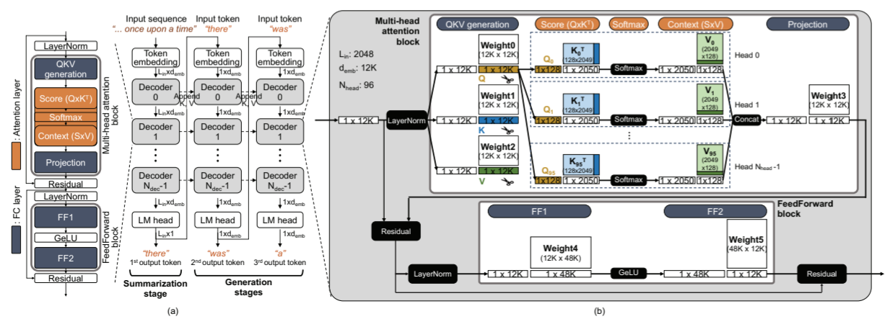

# The simulator for AttAcc
- This post breaks down the simulator for AttAcc(Attention Accelerator).

- The article(henceforth this paper) : 
<a href="https://scale.snu.ac.kr/papers/2024-04-Conference-ASPLOS-AttAcc.pdf" 
target="_blank">AttAcc! Unleashing the Power of PIM for Batched Transformer-based Generative Model Inference
</a>

- The source code : 
<a href="https://github.com/scale-snu/attacc_simulator" 
target="_blank">scale-snu/attacc_simulator
</a> 

- This is the Python-based simulator designed to analyze the transformer-based generation model (TbGM) inference in a heterogeneous system consisting of an xPU and an Attention Accelerator (AttAcc).
- AttAcc : An accelerator for the attention layer of TbGM, which consists of an HBM-based 
<a href="https://semiconductor.samsung.com/technologies/memory/pim/" target="_blank">
PIM
</a>
structure. This accelerator is simulated using a "properly modified <a href="https://github.com/CMU-SAFARI/ramulator2" target="_blank">Ramulator 2.0
</a>".

<figure style="text-align: center;">
  
  <figcaption>inference_process_of_GPT.png[^1]</figcaption>
</figure>  


![inference_process_of_GPT.png[^1]](https://raw.githubusercontent.com/joshua9900sudo/joshua9900sudo.github.io/main/assets/2025-02-09-AttAcc_Code_Breakdown/inference_process_of_GPT.png)


## 1. Set up your local environment according to the prerequisites mentioned in the README.md.
- Python
- cmake, g++, and clang++ (for building Ramulator2)

AttAcc simulator is tested under the following system.

* OS: Ubuntu 22.04.3 LTS (Kernel 6.1.45)
* Compiler: g++ version 12.3.0
* python 3.8.8

We use a similar build system (CMake) as original Ramulator 2.0, which automatically downloads following external libraries.
- [argparse](https://github.com/p-ranav/argparse)
- [spdlog](https://github.com/gabime/spdlog)
- [yaml-cpp](https://github.com/jbeder/yaml-cpp)

## 2. Clone the github repository.
```bash
$ gh repo clone scale-snu/attacc_simulator
$ (or) git clone https://github.com/scale-snu/attacc_simulator.git
$ cd attacc_simulator
$ git submodule update --init --recursive
```

## 3. Build Ramulator2
```bash
$ bash set_pim_ramulator.sh
$ cd ramulator2
$ mkdir build
$ cd build
$ cmake ..
$ make -j
$ cp ramulator2 ../ramulator2
$ cd ../../
```

## 4. How to run
```bash
$ export PYTHONPATH=$PYTHONPATH:$PWD
$ python main.py --system {} --gpu {} --ngpu {} --model {} --lin {} --lout {} --batch {} --pim {} --powerlimit --ffopt --pipeopt
```

## 5. Simulate as the article did
Let's find how to simulate and set arguments according to given conditions. Some example conditions given in this paper will be explained.
### Conditions
- This paper, 2.2. "the NVIDIA DGX A100 with 640GB of HBM3 (DGX)."
- This paper, 3. footnote 2. "^2 All of our analyses and evaluations are based on a system where the GPU memory is replaced with HBM3 in the original DGX-A100."
	- Originally, <a href="https://www.nvidia.com/content/dam/en-zz/Solutions/Data-Center/a100/pdf/nvidia-a100-datasheet-us-nvidia-1758950-r4-web.pdf?utm_source=chatgpt.com" target="_blank">the GPU A100 has HBM2e whose BW(bandwidth) is less than HBM3</a>

### Specification
- Main platform : NVIDIA DGX A100 (consists of 8 GPUs)
- GPU : A100
- Memory : 640GB HBM3 per DGX system (80GB * 8)
- Word size (precision) : FP16 (16-bit Floating Point)
- Model : GPT-3 175B

````bash

# Run Sec. 3.2 Condition of this paper
$ cd path/to/attacc_simulator
$ python main.py --help
# set system configuration
  -h, --help         show this help message and exit
  --system SYSTEM    dgx (each GPU has 80GB HBM), dgx-cpu (In dgx,
                     offloading the attention layer to cpu), dgx-attacc
                     (dgx + attacc) (default: dgx)
  --gpu GPU          GPU type (A100a and H100), A100a is A100 with HBM3
                     (default: A100a)
  --ngpu NGPU        number of GPUs in DGX system. default=8 (default:
                     8)
  --gmemcap GMEMCAP  memory capacity per GPU (GB). default=80 (default:
                     80)
# set attacc configuration
  --pim PIM          pim mode. list: bank, bg, buffer (default: bank)
  --powerlimit       power constraint for PIM (default: False)
  --ffopt            apply feedforward parallel optimization (default:
                     False)
  --pipeopt          apply pipeline optimization (default: False)
# set model and service environment
  --model MODEL      model list: GPT-175B, LLAMA-65B, MT-530B, OPT-66B
                     (default: GPT-175B)
  --word WORD        word size (precision): 1(INT8), 2(FP16) (default:
                     2)
  --lin LIN          input sequence length (default: 2048)
  --lout LOUT        number of generated tokens (default: 128)
  --batch BATCH      batch size, default = 1 (default: 1)

$ python main.py --system dgx --gpu A100a --ngpu 8 --gmemcap 80 --model GPT-175B --word 2
dgx: (A100a x 8), [Lin, Lout, batch]: [2048, 128, 1]
---Run simple mode Batch 1 Lin 2048 Lout 128 pipe False parall False---
    Batch: 1, Throughput: 32.22 tokens/s Latency: 31.03ms, pipe/ff_parallel: False/False, powerlimit: False
````

- The setting of those arguments is the default setting. You can get
same result w/o those arguments.

```bash
$ python main.py --system dgx --gpu A100a --ngpu 8 --gmemcap 80 --model GPT-175B --word 2
dgx: (A100a x 8), [Lin, Lout, batch]: [2048, 128, 1]
---Run simple mode Batch 1 Lin 2048 Lout 128 pipe False parall False---
	Batch: 1, Throughput: 32.22 tokens/s Latency: 31.03ms, pipe/ff_parallel: False/False, powerlimit: False

# Same result w/o those arguments
$ python main.py
dgx: (A100a x 8), [Lin, Lout, batch]: [2048, 128, 1]
---Run simple mode Batch 1 Lin 2048 Lout 128 pipe False parall False---
    Batch: 1, Throughput: 32.22 tokens/s Latency: 31.03ms, pipe/ff_parallel: False/False, powerlimit: False
```

If you have to set L<sub>in</sub>(input length) and L<sub>out</sub>(output length) as
this paper, 2.2 says "When both 𝐿 𝑖𝑛 and 𝐿 𝑜𝑢𝑡 are 32" or "if 𝐿 𝑖𝑛 is 2,048, ..., and 𝐿 𝑜𝑢𝑡 is 128",
```bash
$ python main.py --system dgx --gpu A100a --ngpu 8 --gmemcap 80 --model GPT-175B --word 2 --lin 32 --lout 32
dgx: (A100a x 8), [Lin, Lout, batch]: [32, 32, 1]
---Run simple mode Batch 1 Lin 32 Lout 32 pipe False parall False---
    Batch: 1, Throughput: 36.86 tokens/s Latency: 27.13ms, pipe/ff_parallel: False/False, powerlimit: False

$ python main.py --system dgx --gpu A100a --ngpu 8 --gmemcap 80 --model GPT-175B --word 2 --lin 2048 --lout 128
dgx: (A100a x 8), [Lin, Lout, batch]: [2048, 128, 1]
---Run simple mode Batch 1 Lin 2048 Lout 128 pipe False parall False---
    Batch: 1, Throughput: 32.22 tokens/s Latency: 31.03ms, pipe/ff_parallel: False/False, powerlimit: False

#Or you can just set non-default arguments and get same result.
$ python main.py --lin 32 --lout 32
dgx: (A100a x 8), [Lin, Lout, batch]: [32, 32, 1]
---Run simple mode Batch 1 Lin 32 Lout 32 pipe False parall False---
    Batch: 1, Throughput: 36.86 tokens/s Latency: 27.13ms, pipe/ff_parallel: False/False, powerlimit: False


# This paper, 4.1, within 8th paragraph
$ python main.py --system dgx --gpu A100a --ngpu 8 --gmemcap 80 --model GPT-175B --word 2 --lin 2048 --lout 128 --batch 50
python main.py --system dgx --gpu A100a --ngpu 8 --gmemcap 80 --model GPT-175B --word 2 --lin 2048 --lout 128 --batch 50
dgx: (A100a x 8), [Lin, Lout, batch]: [2048, 128, 50]
---Run simple mode Batch 50 Lin 2048 Lout 128 pipe False parall False---
    Batch: 50, Throughput: 900.32 tokens/s Latency: 55.54ms, pipe/ff_parallel: False/False, powerlimit: False
```

[^1]: <a href="https://scale.snu.ac.kr/papers/2024-04-Conference-ASPLOS-AttAcc.pdf" 
target="_blank">AttAcc! Unleashing the Power of PIM for Batched Transformer-based Generative Model Inference</a> Figure 1.

