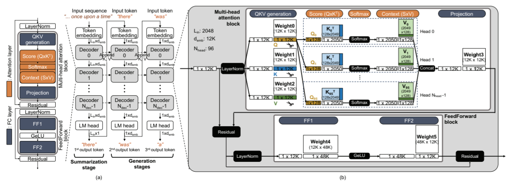

# The simulator for AttAcc
- This post breaks down the simulator for AttAcc(Attention Accelerator).

- The article : 
<a href="https://scale.snu.ac.kr/papers/2024-04-Conference-ASPLOS-AttAcc.pdf" 
target="_blank">AttAcc! Unleashing the Power of PIM for Batched Transformer-based Generative Model Inference
</a>

- The source code : 
<a href="https://github.com/scale-snu/attacc_simulator" 
target="_blank">scale-snu/attacc_simulator
</a> 

- This is the Python-based simulator designed to analyze the transformer-based generation model (TbGM) inference in a heterogeneous system consisting of an xPU and an Attention Accelerator (AttAcc).
- AttAcc : An accelerator for the attention layer of TbGM, which consists of an HBM-based 
<a href="https://semiconductor.samsung.com/technologies/memory/pim/" target="_blank">
PIM
</a>
structure. This accelerator is simulated using a "properly modified <a href="https://github.com/CMU-SAFARI/ramulator2" target="_blank">Ramulator 2.0
</a>".

<figure style="text-align: center;">
  
  <figcaption>inference_process_of_GPT.png[^1]</figcaption>
</figure>


## 1. Set up your local environment according to the prerequisites mentioned in the README.md.
- Python
- cmake, g++, and clang++ (for building Ramulator2)

AttAcc simulator is tested under the following system.

* OS: Ubuntu 22.04.3 LTS (Kernel 6.1.45)
* Compiler: g++ version 12.3.0
* python 3.8.8

We use a similar build system (CMake) as original Ramulator 2.0, which automatically downloads following external libraries.
- [argparse](https://github.com/p-ranav/argparse)
- [spdlog](https://github.com/gabime/spdlog)
- [yaml-cpp](https://github.com/jbeder/yaml-cpp)

## 2. Clone the github repository.
```bash
$ gh repo clone scale-snu/attacc_simulator
$ (or) git clone https://github.com/scale-snu/attacc_simulator.git
$ cd attacc_simulator
$ git submodule update --init --recursive
```

## 3. Build Ramulator2
```bash
$ bash set_pim_ramulator.sh
$ cd ramulator2
$ mkdir build
$ cd build
$ cmake ..
$ make -j
$ cp ramulator2 ../ramulator2
$ cd ../../
```

## 4. How to run
```bash
$ export PYTHONPATH=$PYTHONPATH:$PWD
$ python main.py --system {} --gpu {} --ngpu {} --model {} --lin {} --lout {} --batch {} --pim {} --powerlimit --ffopt --pipeopt
```


[^1]: <a href="https://scale.snu.ac.kr/papers/2024-04-Conference-ASPLOS-AttAcc.pdf" 
target="_blank">AttAcc! Unleashing the Power of PIM for Batched Transformer-based Generative Model Inference</a> Figure 1.

